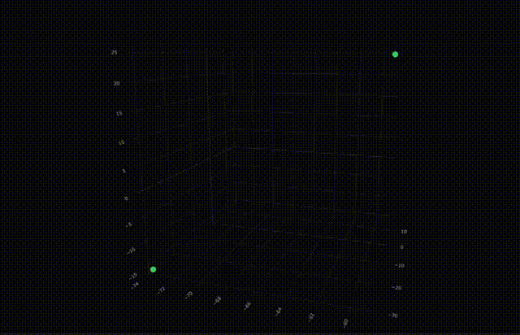

Tell me everything about you, and your disposition. I want to hear about what you were like since the moment you were born. Everything you have ever seen, every move you've made, everything about your health, your genetic makeup, *everything*. It's all important to me.

Now tell me about your world. I want to know about the apartment you grew up in. About the weeping willow you and your sister used to tell stories under. Everything about the schools you attended, your friends, your work, your parents, *share it all*. I'm listening.

---

## Introduction

The **experiential landscape** is a little thought experiment, inspired by Bayesian principles in statistics and reinforcement learning. It goes a little something like this: 

Everything you've ever done in your life has led to this very moment. There was a single trajectory guided by every decision you've made and every person you've chosen to befriend. A little red string, if you will. Everything out of your control was decided by the state of your world--your parents, your hometown, your schooling.

What you, at this very moment, choose to do or not do thus decides everything that is yet to come, given that you know what's going on in your world. What do you choose to do next, and  how do you move your trajectory forward? Don't forget that you had to get to where you are somehow. What choices did you make to bring you here?

Follow the red string back to the moment you were born. The first few years of your life were (probabilistically) determined by the choices of your parents. They unraveled your red string for you, according to what they thought was best (or what they could do). Then, when you were a little older, you too could push your life forward. You learned to tie your shoes, practice your times tables, and read books. You built habits, developed a bedtime routine, and grew up.

The way that our lives unfold, how our red strings unravel, is out of our control. But we follow patterns--probability distributions over our decisions--that make us who we are. We ask ourselves: "What would Dad do in this scenario?" or "How might I have turned out if I hadn't learned an instrument?" These questions dig at the idea of alternate timelines that describe other lives you could have lived, or other lives that other people could have lived. *That* is the experiential landscape; **it is the set of all possible human experiences in which our own lives fall on and travel around, looping about and intersecting with others.** Each of us rolls around this common ground, going through well-trodden paths and discovering new peaks and valleys along the way.

---

This idea is fascinating to me. *The set of all possible human experiences.* It's quite literally everything I could possibly imagine. I'll start with a statistical formalization to help probe some ideas hiding behind the landscape, then discuss other thoughts I have about the experiential landscape.

## A Formalization of the Landscape

For simplicity, let's assume we live life in discrete time. I'm pretty sure the math can be generalized to continuous-time models, but I'm not going to do that here. Also feel free to [skip this section](#further-thoughts) because it's full of math jargon.

### Trajectories and the landscape itself

Let time be indexed by $t \in \{0,1,2,\dots\}$. At each time $t$, a person occupies some possible experiential state
$$
x_t \in \mathcal{X},
$$
where $x_t$ summarizes where a person is at in life. This includes health, skills, relationships, habits, beliefs, memories, and other latent features relevant to future development. We can think of life as a trajectory
$$
\tau = (x_0, x_1, x_2, \dots)
$$
through the *experiential landscape* $\mathcal{X}$. 

Now consider 
$$
h_t = (x_0, x_1, \ldots, x_t),
$$
which denotes the full history of experience up to time $t$. The core Bayesian idea is that, conditioned on this history, there is a distribution over possible futures:
$$
p(x_{t+1:\infty} \mid h_t).
$$
This distribution represents the set of all ways a life could unfold from the present moment onward, given everything that has happened so far. In this sense, the experiential landscape is not just the set of possible states, but the set of possible trajectories together with the probability structure induced by past experience.

### Actions and World Dynamics

To distinguish personal choice from external circumstance, let us write the next state as depending on both an action or decision $a_t \in \mathcal{A}$ and a world state/external context $w_t \in \mathcal{W}$. Then we can imagine transitions of the form
$$
x_{t+1} \sim p(\cdot \mid h_t, a_t, w_t).
$$
Here, $h_t$ captures who/where you are (in life) now, $a_t$ captures what you choose to do at this moment, and $w_t$ describes what the world presents to you. The transition kernel $p$ describes how these combine to shape the next step in your life, though the exact form of this is not important.

The idea here is that people don't choose their entire future directly; rather, it is determined locally, and those local choices push them into regions of the experiential landscape where different futures become more or less likely. As a quick example, we can imagine that some arbitrary decision $\tilde a_t$ which says "save all of the money you currently have and spend as little as possible moving forward" would push a person abiding this rule to grow their wealth, literally affording a different life than someone whose decision rule $\tilde a'_t$ says to spend their money however they please.

### The Bayesian Update

We can say that at time $t$, given a history $h_t = (x_0, \dots, x_t)$, we have an idea of what comes next:
$$
p(x_{t+1} \mid h_t).
$$
This tries to answer the question: "If I am this kind of person now (based on everything up until today), what kind of person will I be tomorrow?" 

We can extend this to include information about our action $a_t$:
$$
p(x_{t+1} \mid h_t, a_t),
$$
which changes the question at hand to: "If I am this kind of person now (based on everything up until today) *and* I do this certain action today, what kind of person will I be tomorrow?"

We can also include information about our environment using $w_t$, which completes the picture:
$$
p(x_{t+1}\mid h_t, a_t, w_t).
$$
This is the answer to "If I am this kind of person now (based on everything up until today), *and* I've surrounded myself with these kinds of friends/live in Boston/it is summertime *and* I do this certain action today, what kind of person will I be tomorrow?"

And even better, we can get a distribution over all future paths:
$$
p(\tau_{t+1:\infty} \mid h_t, a_t, w_t).
$$

The present moment determines not a single future, but a posterior distribution over possible futures, obtained by conditioning on everything that has happened so far, everything you do, and the current world you live in.

### On Character

Our decisions follow patterns. I wake up every day and brush my teeth. Every night before bed I drink a glass of water. 

Let 
$$
\pi(a_t \mid h_t)
$$
be a *policy*, or distribution over actions given one’s history. This policy is meant to capture character, habit, temperament, learned values, discipline, and anything to do with decisions. Two people with identical outward circumstances may still induce different future distributions because they act according to different policies.

At this point, the future is shaped by two forms of uncertainty. We have **uncertainty in the world**, shaped by $p(x_{t+1} \mid h_t, a_t, w_t)$, and we have **uncertainty in the person**, shaped by the policy $\pi(a_t \mid h_t)$.

### Changing the World

The world you live in tomorrow is not independent of who you are today. Where you live, who you spend time with, and what opportunities present themselves are all shaped, at least in part, by your history. For example, that I chose to study statistics in my sophomore year of college meant that a likely world state for me is the statistics lounge. This is formalized as
$$
w_t \sim p(\cdot \mid h_t),
$$
giving the distribution over external circumstances conditioned on a person's history.

### Early Life and Initialization

We are all born into different families in different worlds. The initial starting point of life, or where your red string starts, can be summarized with
$$
x_0 \sim p(\cdot \mid w_0).
$$
Here $w_0$ encodes relevant information about the environment you are born into. Think things like your family, socioeconomic context, culture, schooling, hometown, and so on. Where your life begins is determined by these conditions.

### The Full Generative Picture

I typically like a fair amount of mathematical rigor, and the full generative model here is as follows:
$$
x_0 \sim p(x_0 \mid w_0), \quad a_t \sim \pi(\cdot \mid h_t), \quad x_{t+1} \sim p(\cdot \mid h_t, a_t, w_t).
$$
The distribution over futures is then 
$$
p(x_{t+1:\infty} \mid h_t) = \int \prod_{s = t}^\infty \pi(a_s \mid h_s) p(x_{s+1}\mid h_s, a_s, w_s) p(w_s\mid h_s) \: da_{t: \infty} \: dw_{t:\infty}
$$

The left-hand side of the equation above gives a full distribution over every possible way your life could unfold from now, given your history: "What's tomorrow and the days after going to look like?" 

The right-hand side gives the recipe for answering that question. At each moment, three things interact. Your policy $\pi(a_s \mid h_s)$ encodes how you tend to act given your history, the transition $p(x_{s+1} \mid h_s, a_s, w_s)$, which determines how those actions and the world combine to move you forward, and $p(w_s \mid h_s)$, which captures how the world you face is itself shaped by your past. The product chains the interactions together over time, and we integrate over all possible actions and world states to average out the uncertainty from our actions and the uncertainty from the world.

This expression is intentionally broad, computationally intractable, and most certainly *wrong*. But it's just a model, and statistician George Box said that "All models are wrong, but some are useful." While the usefulness of this model still needs to be probed, there are a few avenues it affords for further thought.

|  | 
|:--:| 
| *A twenty dimensional Gaussian random walk, projected into three dimensions with PCA.   Two of us tumble along the experiential landscape together.* |

---
## Further Thoughts

### Representing Experience

Can we even describe human experiences mathematically? On a scale of one to five, how was your day today? Please rate your experience at the doctor's office out of ten. Did you like this restaurant you just ate at? Give them a five-star review.

Please give me one thousand numbers to describe to me in perfect detail the experience of leaving home for college. What was it like to turn your back on your parents, who were waving goodbye at the security checkpoint? Did your legs want to walk toward the gate thirty minutes early? Was your heart beating faster than normal? Were you tired? How was the flight? Were you scared, or excited?

Some of these things are hard to quantify.

A large body of literature has tried to assign a way of encoding our experiences into a finite number of dimensions. And who's to say this number is fixed? Some of our experiences are more complex than others. I'm not going to try to give an exact number here, but I personally land on the side of more dimensions. I like the idea of human experience being very full, to the point where you'll need a lot to represent it properly. The first quote [here](https://www.imdb.com/title/tt0119217/quotes/) from the movie Good Will Hunting (1997) captures this idea best.

A bashy answer to this question is to say something like, "experience is a product of my brain" and record the state of each neuron in the brain at any given point in time. The human brain has somewhere in the neighborhood of 86 billion neurons, so I think it is safe to say an upper bound of the dimensionality of human experience is in the neighborhood of 100 billion.

### Dimensionality, Sparsity, and Empathy

In high-dimensional spaces, we run into many problems. Intuitively, as dimensions increase the volume of the space grows exponentially, making data points sparse and finding neighbors difficult. Distances between points tend to converge, so it becomes hard to say two points are "close to" or "far from" each other. Two points could be close in one dimension, but far apart in another dimension, overwhelming any distance metric (especially Euclidean distance).

For our high-dimensional experiential landscape, we are all likely kicking around our red balls of yarn farther and farther away from each other, and we wouldn't even be able to tell. This also suggests that if you and I were to vacation with each other, despite us eating at the same restaurants, walking the same streets of town, and swimming in the same beach, there's no guarantee that we were "experiencing" the same things.

This is because you and I are probably at very different parts of life, thus in very different parts of the experiential landscape. Our internal states (memories, expectations, stress levels, goals, identities, prior experiences) may differ along hundreds or thousands of latent dimensions that dominate whatever similarity exists in the observable environment. Our vacation either a) pushes us in the same directions through the experiential landscape or b) pushes us toward each other (whatever the notion of "toward" means in high dimensions). In this sense, two people can share a vacation without sharing an experience.

It's a little hard to believe, but there are two ways to view this.

If I went to a local restaurant and order spiced beef empanadas, I'll have a pretty good dining experience. If I go back a month later to the same restaurant, and order spiced beef empanadas, they'll probably still be pretty good, but it just won't be the same experience. The restaurant didn't change, the food is the same, but I've moved along my life trajectory for an entire month. Even though it's the same meal, they'll induce different feelings. Analogously, our time together at the restaurant finds us at different parts of the landscape.

Another way to think about it to assume human experience is sparse; though our experiences may be captured across hundreds of thousands of dimensions, only a few are meaningful. This follows from [sparse coding](https://en.wikipedia.org/wiki/Sparse_dictionary_learning). In this sense, on our shared vacation our experiences align on those meaningful dimensions. Two people may inhabit the same external event without sharing the same total experience, yet still overlap where it matters most. We may carry around an enormous experiential state space, but only a small subset of dimensions meaningfully lights up in response to a situation. On our vacation, the most salient dimensions count--perhaps wonder, relaxation, novelty, comfort, adventure, disappointment. If we go through those together, though we are never experiencing precisely the same world, but neither are we locked in total isolation from one another.

Because of course we aren't. We share tears, we laugh with each other, and we love. However vast and private our inner landscapes may be, there are still sparse and meaningful axes along which they do align.

 ## Conclusion

I'm fortunate enough to have met a lot of really, *really* cool people in my life. My best friends have their interesting stories, cherished memories, highest highs, lowest lows, and daily mundanities that have dragged them through their lives. As do I. As do the strangers I see on my commute to class, the waiter serving the beef empanadas I've ordered. As do my parents. 

When we start to learn about the parts of the experiential landscape we've both traveled through, we really start to understand each other. It's a basis for the empathy we have for each other, and it's something we should never let go.

So I ask, what parts of the experiential landscape have you been to? Perhaps we can go visit again sometime.